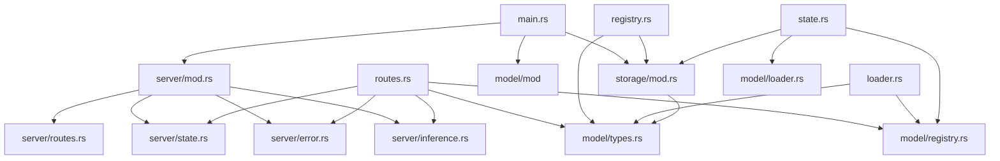

# Repository Map: ollama-rs

## Project Structure

```
ollama-rs/                          # Root — Rust binary crate
│
├── Cargo.toml                      # Package manifest (v0.1.0, edition 2021)
├── Cargo.lock                      # Dependency lockfile
├── README.md                       # Quickstart + API docs
├── .gitignore                      # Git ignore rules
│
├── src/
│   ├── main.rs                     # Entry point — tracing + server startup (25 lines)
│   │
│   ├── api/
│   │   └── mod.rs                  # Public re-exports for library usage (5 lines)
│   │
│   ├── model/
│   │   ├── mod.rs                  # Module re-exports (6 lines)
│   │   ├── types.rs                # 20+ API request/response structs (219 lines)
│   │   ├── registry.rs             # In-memory model registry + disk CRUD (95 lines)
│   │   └── loader.rs               # Model pull/download with progress (153 lines)
│   │
│   ├── server/
│   │   ├── mod.rs                  # Axum server setup + middleware (32 lines)
│   │   ├── state.rs                # AppState (Arc<ModelRegistry> + loader + store) (22 lines)
│   │   ├── routes.rs               # All 15 route handlers (430 lines)
│   │   ├── inference.rs            # Stub inference engine (69 lines)
│   │   └── error.rs                # ApiError → HTTP JSON responses (38 lines)
│   │
│   └── storage/
│       └── mod.rs                  # Filesystem persistence for manifests/blobs (83 lines)
│
├── startup-builder-memory/         # Startup Builder artifacts (new)
│   ├── product-brief.md
│   ├── architecture-map.md
│   ├── repo-map.md
│   └── task-ledger.md
│
└── target/                         # Build artifacts (gitignored)
    └── ...
```

## Dependency Map



## External Dependencies (Cargo.toml)

| Crate | Version | Purpose |
|-------|---------|---------|
| `tokio` | 1 (full) | Async runtime |
| `axum` | 0.6 (json) | HTTP framework |
| `serde` | 1 (derive) | Serialization |
| `serde_json` | 1 | JSON handling |
| `tower` | 0.4 | Middleware |
| `tower-http` | 0.4 (cors, trace) | CORS + logging |
| `tracing` | 0.1 | Structured logging |
| `tracing-subscriber` | 0.3 (env-filter) | Log filtering |
| `uuid` | 1.6.1 (v4) | Chat completion IDs |
| `chrono` | 0.4 (serde) | Timestamps |
| `tokio-stream` | 0.1 | Stream adapters |
| `futures` | 0.3 | Stream combinators |
| `bytes` | 1 | Byte buffer |
| `anyhow` | 1 | Error handling |
| `thiserror` | 1 | Error derive |
| `dirs` | 5 | Home directory detection |
| `sha2` | 0.10 | Digest verification |
| `hex` | 0.4 | Hex encoding |
| `indicatif` | 0.17 | Progress bars |
| `getrandom` | 0.2.15 | Random entropy |

## Key Patterns

### Shared State Pattern
```rust
pub struct AppState {
    pub registry: Arc<ModelRegistry>,  // Thread-safe model cache
    pub loader: Arc<ModelLoader>,      // Download coordinator
    pub store: ModelStore,             // Clone — cheap (PathBuf)
}
```

### Registry Pattern
```rust
pub struct ModelRegistry {
    models: Arc<RwLock<HashMap<String, ModelInfo>>>,  // Concurrent map
    store: ModelStore,                                 // Disk persistence
}
```

### Error Pattern
```rust
pub struct ApiError {
    status: StatusCode,
    message: String,
}
// Implements IntoResponse → Axum integration
// Implements From<anyhow::Error> → ? operator with anyhow
```

## File Sizing & Complexity

| File | Lines | Complexity | Notes |
|------|-------|------------|-------|
| `routes.rs` | 430 | High | 15 handlers, streaming logic |
| `types.rs` | 219 | Medium | Pure data types |
| `loader.rs` | 153 | Medium | Simulated download, progress streaming |
| `registry.rs` | 95 | Low-Medium | HashMap CRUD + disk sync |
| `storage/mod.rs` | 83 | Low | JSON file CRUD |
| `inference.rs` | 69 | Low | Stub — main FFI hook point |
| `server/mod.rs` | 32 | Low | Server setup |
| `error.rs` | 38 | Low | Error type |
| `state.rs` | 22 | Low | Shared state |
| `main.rs` | 25 | Low | Entry point |

---

*Generated: 2026-06-29*
